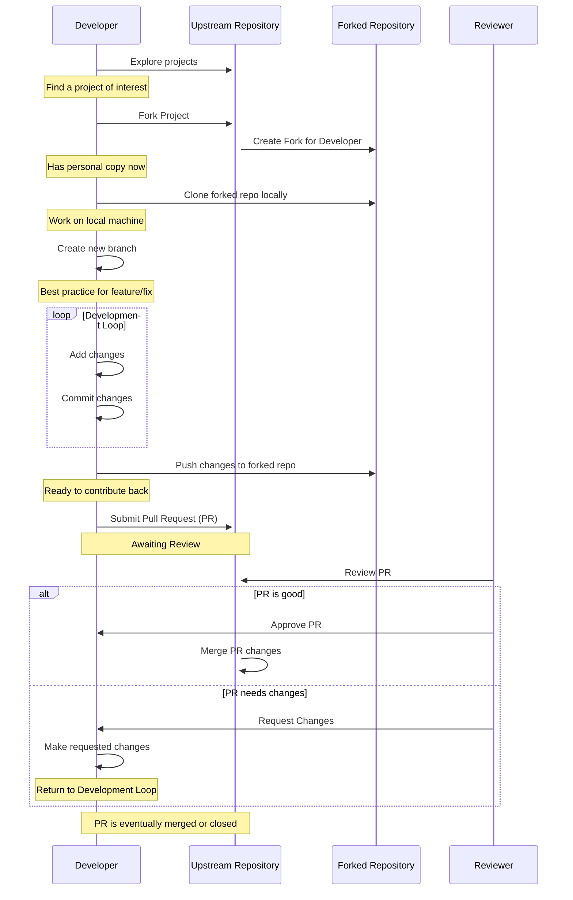

<!--
Welcome to git-into-open-source! Great to have you here :)
Before you edit this file, please be sure you've read the .github/CONTRIBUTING.md guide
As a lot of the content here is auto-generated by the scripts in /lib, via GH actions
So if you edit anything between the xx-start / xx-end tags - it will be over-written!!
-->

<h1 align="center">Git Into Open Source!</h1>

<p align="center">
<a><br /></a>
<b><i>Tools and resources to help you get started with open source</i></b>
<br />
<i>Create your first pull request here!</i><br />
<b>🌐 <a href="https://git-in.to/">git-in.to</a></b><br />
</p>

<details open>
<summary><b>Contents</b></summary>

- [📚 Guides and Resources](#guides-and-resources)
- [🛣️ Roadmap](#roadmap)
- [👾 Git In!](#git-in)
- [🗃 Finding Projects](#finding-projects)
- [🫵 Contributing](#contributing)
- [⚖️ License](#license)

<details>
  <summary><a href="#repo-admin">📂 Repository Admin</a></summary>

  - [🌐 Website](#website)
  - [🪞 Mirror](#mirror)
  - [📜 Policies](#policies)
  - [🤖 Automations](#automations)
  - [🎖️ Credits](#service-credits)
  - [💖 Supporters](#supporters)
  - [👥 Contributors](#contributors)
  
</details>

</details>

## Intro

The aim of this repo is to provide a roadmap, along with some helpful guides and resources to help anyone, of any level to get into open source.

Why? Because open source is awesome! It's the backbone for almost all modern software, and has enabled people from all over the world collaborate to build eipc stuff. It's a place where everyone has a chance to learn, contribute, and make an impact. The beauty of open source lies in its accessibility and inclusivity, with welcoming communities which are open to anyone.

If you're new here, and looking to make your first pull request, check out the [Git in](#git-in) section below, where you can submit a PR and have your name included on the list!

---

## Guides and Resources

#### Open Source Guides
<!-- guides-start -->
-  [Why Open Source?](/guides/why-open-source.md)
-  [Submit your first PR (UI)](/guides/submit-your-first-pr-ui.md)
-  [Full Local Git Setup](/guides/local-git-setup.md)
-  [Submit your first PR (CLI)](/guides/submit-your-first-pr-cli.md)
-  [Open Source for Businesses](/guides/open-source-for-businesses.md)
<!-- guides-end -->

#### External Resources
<!-- resources-start -->
-  [Simple Introduction to Git](https://rogerdudler.github.io/git-guide/)
-  [Open Source Guides from GitHub](https://opensource.guide/)
-  [Good First Issue - Find beginner-friendly tickets](https://goodfirstissue.dev/)
-  [First Contributions - Find projects to contribute to](https://firstcontributions.github.io/)
-  [Code Triage - Find Projects to Contribute to](https://www.codetriage.com/)
-  [Outreachy - Paid Open Source Internships for Beginners](https://www.outreachy.org/)
-  [Learn Git - Comprehensive yet simple guide from BitBucket](https://www.atlassian.com/git/tutorials/learn-git-with-bitbucket-cloud)
-  [Git Immersion - Quick walk through of Git](https://gitimmersion.com)
-  [Git Tips & Tricks](https://github.com/git-tips/tips)
-  [GitHub Cheatsheet and Hidden Features](https://github.com/tiimgreen/github-cheat-sheet)
-  [Git GUIs for Windows, Mac and Linux](https://git-scm.com/downloads/guis)
-  [All about Git Hooks](https://githooks.com/)
-  [Effective branching patterns of larger teams](https://martinfowler.com/articles/branching-patterns.html)
-  [Choose an open source license](https://choosealicense.com/)
-  [Git Command Explorer](https://gitexplorer.com/)
<!-- resources-end -->

<p align="right"><sup><a href="#git-into-open-source">⬆️ Back to Top</a></sup></p>

---

## Roadmap

The following roadmap covers all the core skills and areas you may want to research, if you're looking to become an open source master. 

This idea was inspired by [roadmap.sh](https://roadmap.sh/) - which you should definitely check out if you haven't already! They provide some awesome developer roadmaps and learning pathways for various tech stacks.

<!-- roadmap-start -->
<details>
<summary><sub>🦯 Click here if you cannot see the chart</sub></summary>

This diagram is written using Mermaid- [view the chart source here](https://mermaid.live/edit#pako:eNp9V39v2zYQ/SpEijQqYKOz86Oth26ILcsO4LRekrYY0H8o6WRxoUmBpJx4Rb77jqIoy3I8BLDl3CN59+7dHfXrJJEpnIzIyenpr5+CECaYGZHqkZAzk8MazkbkLKYaznrt/36nitGYgz5r4GgqFFtTtZ1ILpVd9ya9+HSRZX7pDvEAz2aHGlzh38dD1FiqFNT/4DgTsDNfxZDBby2zhkSKdM+hy+jyIrxsYQwow/YgGTrszC/2Cz9eTk9/ip9ipWiRk8WdfbZmbbYcyDXJGOejNx8uP9H08ve2aVybPiUfrwD2TJPjpvC4aXrcFB03zY6b5q+Z3Od1kNFRRvtWIf1YUZHk5GsBgtzLUiXoJmyAywIUuZM0XdPinefl9JTcG7oCMqh3Ip8//0HG9X4Fp1tvH5EbYZRMy8QwKd45+NjBB8GPnBrCdPvUPz1mQPp9C6LBMmdcalnkW/KWLBUTCStQl11gHIxBQMaMJn2CyeY0loraY3vkAaPTBVUgkm0Pjet1iXWw7W6RBJOccg5iBXaTBUtAaCZWPTKTG1ACKYIeuS+1oUzQmHG3R4eUYZuUSU3Kkz0794gRiUrU7RqEoZw8SMl9OBO3ahB8B6XRd3TWEsjJEzM5mTHjcc7nCfIzppol1t8bjKlHrtPUhWh/LEud20/Ou+uQrirlGB7SegtqhU9dUBLMqUi5xaAfGWeJ0V1Mirxrg4mhmOOkysteKMPgm+XQ+j4v4/f4taDx+zEzcZk8QhPP0G03pMEdFFIzIxUD3SM3WpeYDcz8ne5i4yCS6tFuvtFkwqVoheAxSeAOJteVBCtx3LyfhMTRdpi+83b6wlaNePuIhGwD2EmNRFbS3ZlhdWQ4CJYseSSULKhYlbjEmwe1vUnZW0zWxooqRQ0Uzps9ZBwsGFamZQLBkULFPGHEBzgUrtc04u7LopDKNKGFLpRhsFTyH0gMBqKwIEsFCA5Bs5UgS2qwUYpmZ0dfiOn4JrBFo+KFjXSvQWDwYAdHd01ceYPavVaoLwP2KJT5sSOs88juXyXltf/2MKrSV5Jz0U7O1DcckNgQ+nZWeNiITMWKWkm7wsGRdlD2U7fJIIiYi82C7tgqt2KuiPJAR/MUEzeTMiURQz6cMNHbMeAxArtkhGnCYtl2V8We9zNNvjNdNaSZpBzFjXEeNNfaraFPaVL1MHL/iH3cczd13E0xPU2cTKAudVJqe8IBMK7KCichIsflysppKnKrPduEDuB1Tu5gw+CJTE3u5Hqk0pv0XLbTE9XpwVNS3c8ltyT3URE89fARuaWP4Hoci0vT8jxyewyCUCZl1SgrGt6SB/RhV3ORYznC3PxQrApvwoEqsresC45R1cz4repN+6HCuhZ+7tnFTYS1N8MAucP8P7t6BFoV0StERo7ICBMUQlyuqgxh2VGDaoEDlK2YZmB5zfpqvcVhYwcOVmHXn/OmpHcDynZzKpDeOoAKfu4OOu+W806ZrQ1uMfW8uxIFJPE+IbO2P71d6qSq9fxNtx1tpHHVlsaslgb2NpRtDRgd6YYzt2QQtHtPM5s9yKV2hjqom49DVIP89uYBS265wOFY0CSH7hqkP5eymlLUryOZVORvPKzVDPb8GQb7FwHLuxRg2L9tyc1cimdWCFJUFsuakk9pVlY5QM9wEDfKaRbELt6JVHjnCLE5tu8jS8pS3+ddvl6h/EOb8nlNuZJ26nrEyIX49Ul0et7cLRoECHRdg5Iv2Ao6KMfgfGBlnjE7f+sWZ9t4gpfHLjBuTapxyaqe0FXsnge2Dwp0oJSltpdJWCnfCUIouNy2ZD533M2RbDfjl6wAOxZ0lc2WfroL4qC6hKFW8Kq4wSvp5AazxFTCwT7tXyG6Lu6qcAHUVlfOiupOJewlppHo3JXSHIvwS6mwc9jQLaftGupi4+AejGmRZB+nzwWeRr0zJz1ysga1Rk3gm96vk+r9zb7zpZDRkpuTl5f/AJm9R4I=)

```mermaid
%%{
  init: {
    'theme': 'base',
    'themeVariables': {
      'primaryColor': '#d494ff',
      'primaryTextColor': '#161618',
      'primaryBorderColor': '#161618',
      'lineColor': '#6befe0',
      'secondaryColor': '#5F54D5',
      'tertiaryColor': '#fff'
    }
  }
}%%

graph LR

    style A fill:#759ad5;
    style B fill:#9c86ee;
    style C fill:#9c86ee;
    style D fill:#9c86ee;
    style E fill:#9c86ee;
    style F fill:#9c86ee;
    style G fill:#9c86ee;
    style H fill:#9c86ee;
    
    A(fa:fa-code-branch Open Source Developer Roadmap)

    %% Stage 1
    A ==> B(fa:fa-play Stage 1: Introduction)
    B ==> B1(What is Open Source?)
    B1 --> B1a(Philosophy & Principles)
    B1 --> B1b(Benefits - Collaboration, Transparency, Community)
    B1 --> B1c(Challenges - Licensing, Governance, Sustainability)

    %% Stage 2
    A ==> C(fa:fa-wrench Stage 2: Fundamental Tools)
    C ==> C1(Version Control with Git)
    C1 --> C1a(Basics - Init, Add, Commit, Push, Pull)
    C1 --> C1b(Branching & Merging)
    C1 --> C1c(Handling Conflicts)
    C1 --> C1d(Best Practices)

    C ==> C2(Using GitHub/GitLab/Bitbucket)
    C2 --> C2a(Repositories, Issues & PRs)
    C2 --> C2b(Forking vs Cloning)
    C2 --> C2c(GitHub Actions - CI/CD Basics)

    %% Stage 3
    A ==> D(fa:fa-code Stage 3: Dive into Coding)
    D --> D1(Pick a Language)
    D1 --> D1a(Basics & Advanced Topics)
    D1 --> D1b(Libraries & Frameworks)
    D1 --> D1c(Community & Support)

    D ==> D2(Project Structure & Design Patterns)
    D2 --> D2a(Understanding Open Source Codebase)
    D2 --> D2b(Common Architectural Patterns)
    D2 --> D2c(Code Quality & Standards)

    %% Stage 4
    A ==> E(fa:fa-people-line Stage 4: Engaging with the Community)
    E ==> E1(Finding the Right Project)
    E1 --> E1a(Good First Issue & Beginner Friendly)
    E1 --> E1b(Project's Vision, Goals, and Roadmap)

    E ==> E2(Communication Skills)
    E2 --> E2a(Engaging in Discussions)
    E2 --> E2b(Reporting Bugs & Enhancements)
    E2 --> E2c(Code Review Ethics & Best Practices)

    %% Stage 5
    A ==> F(fa:fa-hands-holding-child Stage 5: Make Contributions)
    F ==> F1(Documentation & Testing)
    F1 --> F1a(Writing Clear Documentation)
    F1 --> F1b(Unit Testing & Test-Driven Development)

    F ==> F2(Bug Fixes & Feature Enhancements)
    F2 --> F2a(Debugging Strategies)
    F2 --> F2b(Collaborating with Project Maintainers)

    F ==> F3(Project Governance & Management)
    F3 --> F3a(Understanding Project's Governance Model)
    F3 --> F3b(Role of Maintainers, Contributors, and Users)

    %% Stage 6
    A ==> G(fa:fa-brain Stage 6: Advanced Topics)
    G ==> G1(Open Source Licensing)
    G1 --> G1a(Common Licenses - MIT, GPL, Apache)
    G1 --> G1b(Choosing a License for Your Project)

    G ==> G2(Sustainability & Monetization)
    G2 --> G2a(Donations, Crowdfunding, Grants)
    G2 --> G2b(Open Core, Dual Licensing, Paid Support Models)

    %% Stage 7
    A ==> H(fa:fa-rocket Stage 7: Your Own Project)
    H ==> H1(Starting a New Project)
    H1 --> H1a(Defining Vision & Scope)
    H1 --> H1b(Community Building & Management)

    H ==> H2(Continuous Integration & Deployment)
    H2 --> H2a(CI/CD Pipelines for Open Source)
    H2 --> H2b(Tools - Travis CI, CircleCI, GitHub Actions)

    H ==> H3(Project Leadership & Mentoring)
    H3 --> H3a(Nurturing New Contributors)
    H3 --> H3b(Setting & Managing Expectations)

```

[](https://mermaid.live/view#pako:eNp9V39v2zYQ/SpEijQqYKOz86Oth26ILcsO4LRekrYY0H8o6WRxoUmBpJx4Rb77jqIoy3I8BLDl3CN59+7dHfXrJJEpnIzIyenpr5+CECaYGZHqkZAzk8MazkbkLKYaznrt/36nitGYgz5r4GgqFFtTtZ1ILpVd9ya9+HSRZX7pDvEAz2aHGlzh38dD1FiqFNT/4DgTsDNfxZDBby2zhkSKdM+hy+jyIrxsYQwow/YgGTrszC/2Cz9eTk9/ip9ipWiRk8WdfbZmbbYcyDXJGOejNx8uP9H08ve2aVybPiUfrwD2TJPjpvC4aXrcFB03zY6b5q+Z3Od1kNFRRvtWIf1YUZHk5GsBgtzLUiXoJmyAywIUuZM0XdPinefl9JTcG7oCMqh3Ip8//0HG9X4Fp1tvH5EbYZRMy8QwKd45+NjBB8GPnBrCdPvUPz1mQPp9C6LBMmdcalnkW/KWLBUTCStQl11gHIxBQMaMJn2CyeY0loraY3vkAaPTBVUgkm0Pjet1iXWw7W6RBJOccg5iBXaTBUtAaCZWPTKTG1ACKYIeuS+1oUzQmHG3R4eUYZuUSU3Kkz0794gRiUrU7RqEoZw8SMl9OBO3ahB8B6XRd3TWEsjJEzM5mTHjcc7nCfIzppol1t8bjKlHrtPUhWh/LEud20/Ou+uQrirlGB7SegtqhU9dUBLMqUi5xaAfGWeJ0V1Mirxrg4mhmOOkysteKMPgm+XQ+j4v4/f4taDx+zEzcZk8QhPP0G03pMEdFFIzIxUD3SM3WpeYDcz8ne5i4yCS6tFuvtFkwqVoheAxSeAOJteVBCtx3LyfhMTRdpi+83b6wlaNePuIhGwD2EmNRFbS3ZlhdWQ4CJYseSSULKhYlbjEmwe1vUnZW0zWxooqRQ0Uzps9ZBwsGFamZQLBkULFPGHEBzgUrtc04u7LopDKNKGFLpRhsFTyH0gMBqKwIEsFCA5Bs5UgS2qwUYpmZ0dfiOn4JrBFo+KFjXSvQWDwYAdHd01ceYPavVaoLwP2KJT5sSOs88juXyXltf/2MKrSV5Jz0U7O1DcckNgQ+nZWeNiITMWKWkm7wsGRdlD2U7fJIIiYi82C7tgqt2KuiPJAR/MUEzeTMiURQz6cMNHbMeAxArtkhGnCYtl2V8We9zNNvjNdNaSZpBzFjXEeNNfaraFPaVL1MHL/iH3cczd13E0xPU2cTKAudVJqe8IBMK7KCichIsflysppKnKrPduEDuB1Tu5gw+CJTE3u5Hqk0pv0XLbTE9XpwVNS3c8ltyT3URE89fARuaWP4Hoci0vT8jxyewyCUCZl1SgrGt6SB/RhV3ORYznC3PxQrApvwoEqsresC45R1cz4repN+6HCuhZ+7tnFTYS1N8MAucP8P7t6BFoV0StERo7ICBMUQlyuqgxh2VGDaoEDlK2YZmB5zfpqvcVhYwcOVmHXn/OmpHcDynZzKpDeOoAKfu4OOu+W806ZrQ1uMfW8uxIFJPE+IbO2P71d6qSq9fxNtx1tpHHVlsaslgb2NpRtDRgd6YYzt2QQtHtPM5s9yKV2hjqom49DVIP89uYBS265wOFY0CSH7hqkP5eymlLUryOZVORvPKzVDPb8GQb7FwHLuxRg2L9tyc1cimdWCFJUFsuakk9pVlY5QM9wEDfKaRbELt6JVHjnCLE5tu8jS8pS3+ddvl6h/EOb8nlNuZJ26nrEyIX49Ul0et7cLRoECHRdg5Iv2Ao6KMfgfGBlnjE7f+sWZ9t4gpfHLjBuTapxyaqe0FXsnge2Dwp0oJSltpdJWCnfCUIouNy2ZD533M2RbDfjl6wAOxZ0lc2WfroL4qC6hKFW8Kq4wSvp5AazxFTCwT7tXyG6Lu6qcAHUVlfOiupOJewlppHo3JXSHIvwS6mwc9jQLaftGupi4+AejGmRZB+nzwWeRr0zJz1ysga1Rk3gm96vk+r9zb7zpZDRkpuTl5f/AJm9R4I=)
</details>


<!-- roadmap-end -->

<p align="right"><sup><a href="#git-into-open-source">⬆️ Back to Top</a></sup></p>

---

## Git In!

The following users have contributed to this repo, by sharing their thoughts and ideas about open source.<br />
Join them by editing the [`git-in-here.yml`](/git-in-here.yml) file, and following the instructions in [`CONTRIBUTING.md`](/.github/CONTRIBUTING.md) to submit a PR.


<!-- git-in-start -->
User | Contribution
---|---
<a href='https://github.com/ZuhairHossain' title='Bangladeshi  DevOps Engineer Therap BD Ltd  Graduated from BRAC University'>Syed Zuhair Hossain ⭐<br /></a> <br /><kbd title='Followers, following and repo count for ZuhairHossain'>🫂 91 ┃ 👣 48 ┃ 🗃 81</kbd> <br /><sup>🌐 [zuhairhossain.github.io](https://zuhairhossain.github.io/)</sup>  | **I balance open source work alongside my day job by:**<br />I am a quite scheduling person who likes to maintain a proper scheduling in life and thus I get enough time to work after office hours. In short, disciplined life is the main thing.
<a href='https://github.com/araguaci' title='CruxSacraSitMihiLux NonDracoSitMihiDux VRSNSMVSMQLIVB Non nobis Domine nobis sed nom ini tuo ad gloriam'>araguaci ⭐<br /></a> <br /><kbd title='Followers, following and repo count for araguaci'>🫂 184 ┃ 👣 2218 ┃ 🗃 1199</kbd> <br /><sup>🌐 [artesdosul.com](http://www.artesdosul.com/)</sup>  | **I want to get into open source because:**<br />Thank you for your contributions, your projects are very cool, a lot of difficulty in learning these new technologies alone, the courses are very expensive in BR. Their designs are beautiful and very creative. Your advice to start with a project that we are passionate about is perfect, I work mainly as a volunteer and taking these technologies to friends who know very little and don't even know how to use a computer, there are still people like that... I love your work, soon I will be sponsoring. 🫶
<a href='https://github.com/Sanchitbajaj02' title='Software Engineer Infozech  Freelance Developer   Tech Enthusiast   Blogger   Reach out to me to build your brand'>Sanchit Bajaj ⭐<br /></a> <br /><kbd title='Followers, following and repo count for Sanchitbajaj02'>🫂 100 ┃ 👣 162 ┃ 🗃 98</kbd> <br /><sup>🌐 [sanchit.is-a.dev](https://sanchit.is-a.dev)</sup>  | **I've built or contributed to a project that I'd like to share here, which is:**<br />I am currently developing an open-source project called 'Palettegram.' The idea for this project originated a few months ago when I was working on a client's project. I had to design a website based on the client's unique needs, which sometimes didn't align with standard design practices. During that project, I felt the need for a platform where design professionals could review my work, and I could draw inspiration from other designers. I realized that such a platform would be immensely valuable.     
<a href='https://github.com/aeejaz' title='computer science engineer founder'>Ejaj Ahmed<br /></a> <br /><kbd title='Followers, following and repo count for aeejaz'>🫂 23 ┃ 👣 8 ┃ 🗃 16</kbd>  <br /><sup>🐦 [@aeejazkhan](https://x.com/aeejazkhan)</sup> | **The advice I would give to someone new to open source is:**<br />Start with projects you're passionate about and begin with small, well-documented contributions to ease your entry into the open source community.
<a href='https://github.com/AKSHATH99' title='i build full stack website  Nextjs  Typescript'>010101<br /></a> <br /><kbd title='Followers, following and repo count for AKSHATH99'>🫂 13 ┃ 👣 6 ┃ 🗃 57</kbd>  <br /><sup>🐦 [@AkshathP2](https://x.com/AkshathP2)</sup> | **I want to get into open source because:**<br />I am into open-source to explore and contrubute into real world examples of what i am learning . It gives me immense pleasure when i am able to bring changes/improvements into someone's application , be it small or    big changes, using my little knowledge. I am mostly into web development and as i dive deep into  repositories in Open Source , I am learning new stuffs everyday.
<a href='https://github.com/denschiro' title=''>denschiro ⭐<br /></a> <br /><kbd title='Followers, following and repo count for denschiro'>🫂 1 ┃ 👣 5 ┃ 🗃 44</kbd>   | **The tech (tools, languages, libraries, etc) I most use and love is:**<br />I love Python and am always amazed at how easy it is to solve projects with the  almost countless libraries like Tensorflow, OpenCV and also the bandwidth like Micropython always impresses me.
<a href='https://github.com/Kaustubh2904' title=''>Kaustubh Upadhyay ⭐<br /></a> <br /><kbd title='Followers, following and repo count for Kaustubh2904'>🫂 5 ┃ 👣 11 ┃ 🗃 59</kbd>  <br /><sup>🐦 [@Kaustub15852947](https://x.com/Kaustub15852947)</sup> | **The most rewarding thing I've experienced in my open-source journey is:**<br />In my open-source journey, I've gained new friendships, planted a tree through Hacktoberfest 2023  and learned extensively. This experience has broadened my network, made a positive environmental impact,  and improved my technical skills, highlighting the significant value of open-source contributions.
<a href='https://github.com/Euler-271' title=''>Euler-271 ⭐<br /></a>    | **The tech (tools, languages, libraries, etc) I most use and love is:**<br />I use python a lot! Its a great language for machine learning and data science.There are many machine learning libraries such as tensorflow, pytorch, OpenCV etc which i use on a daily basis for my projects. Machine Learning is a exciting field and everyone should try it!
<a href='https://github.com/Odeyiany2' title='Exploring Data Science and ML'>Miriam  ⭐<br /></a> <br /><kbd title='Followers, following and repo count for Odeyiany2'>🫂 13 ┃ 👣 14 ┃ 🗃 40</kbd> <br /><sup>🌐 [datascienceportfol.io/mir...](https://www.datascienceportfol.io/miriamodeyiany)</sup>  | **The tech (tools, languages, libraries, etc) I most use and love is:**<br />One tech tool I really love is the Jupyter Notebook. It so easy to use and navigate.  As a noob in Data science and Machine Learning and this tool has definitely helped make my work fun and easy to handle. I most especially love how I get error messages and also  a prompt as to where the error occured. I have always loved coding in python and one library I use a lot when working on projects is the Seaborn library. For me, it just gives a different feel to my visualizations.
<a href='https://github.com/AryanSaxenaa' title=''>Aryan Saxena<br /></a> <br /><kbd title='Followers, following and repo count for AryanSaxenaa'>🫂 11 ┃ 👣 10 ┃ 🗃 42</kbd> <br /><sup>🌐 [aryansaxenaa.github.io/ar...](http://aryansaxenaa.github.io/aryansaxena.github.io/)</sup>  | **I want to get into open source because:**<br />I want to contribute to open source to gain hands-on experience, and work on substantial projects. It's a valuable opportunity to enhance my technical skills, collaborate with a global community, and give back to the  software development world. Open source contributions serve as a portfolio, showcasing real-world experience and dedication to continuous learning, making it a win-win for personal and professional growth.
<a href='https://github.com/sassy-bugs' title='Observer  Learner  Achiever'>Agrima Gupta<br /></a> <br /><kbd title='Followers, following and repo count for sassy-bugs'>🫂 6 ┃ 👣 4 ┃ 🗃 25</kbd>   | **The advice I would give to someone new to open source is:**<br />Trust me when I say that you get the true feels of a developer is not when you deploy your project but when you give back to the community and solve the issues of open source techstacks you actually used in your project. In the beginning all of it can seem a bit overwhelming but truly just trust the process, your are definitely onto something great.
<a href='https://github.com/scd-02' title='Hello I am Sourav Chandra Dey I am currently pursuing CSE at ITER Bhubaneshwar Lets connect and collaborate on something awesome'>Sourav Chandra Dey ⭐<br /></a> <br /><kbd title='Followers, following and repo count for scd-02'>🫂 24 ┃ 👣 15 ┃ 🗃 21</kbd> <br /><sup>🌐 [scd-02.github.io](scd-02.github.io)</sup>  | **The most rewarding thing I've experienced in my open-source journey is:**<br />The most rewarding thing I have experienced is that open source helps me enhance my skills,   and I can seek help from this diverse and large community anytime I am stuck.
<a href='https://github.com/lavanderhoney' title='Im a final year CSE undergrad student at Nirma University Im passionate about  AIML and Deep Learning and Quantum Computing'>Milap Patel<br /></a> <br /><kbd title='Followers, following and repo count for lavanderhoney'>🫂 8 ┃ 👣 8 ┃ 🗃 38</kbd>   | **I want to get into open source because:**<br />I want to get started to open source contribution so that I can learn contributing to projects and get some hands-on experience in development. I also get to learn version control skills like Git, and hope to shine my coding skills and learn new language by contributing to projects. Open source contributions  will also decorate my CV, and increase my chances of getting a remote job or better off-campus placements, and I'm also aiming for next year's GSoc, so this is a great way for me to practice.
<a href='https://github.com/Addyk16' title=''>Addy<br /></a>    | **The most rewarding thing I've experienced in my open-source journey is:**<br />For me, it has always been the people I get to meet, or the ideas that are shared while working on the open source projects. Seeing your code implemented is always a cherry on top
<a href='https://github.com/YashkShrivas4491' title='Ex Backend Developer KreupAITechnology'>Yash Kumar Shrivas  ⭐<br /></a> <br /><kbd title='Followers, following and repo count for YashkShrivas4491'>🫂 28 ┃ 👣 19 ┃ 🗃 102</kbd> <br /><sup>🌐 [yashshrivastech.vercel.ap...](https://yashshrivastech.vercel.app/)</sup>  | **The advice I would give to someone new to open source is:**<br />Hey Folks 👋🏻💻, if don't know about open-source and how to contribute, don't worry you will get there just by learning, doing hands-on practice and sharing knowledge with others, I also want to say that learning in public plays a very significant role because it can create lots of opportunities for you.
<a href='https://github.com/kiddjsh' title='Graduate of DeVry University Bachelor of Science in Computer Information Systems Software Programming Magna Cum Laude NSLS Sigma Alpha Pi AWS Certified'>kiddjsh ⭐<br /></a> <br /><kbd title='Followers, following and repo count for kiddjsh'>🫂 8 ┃ 👣 23 ┃ 🗃 53</kbd>   | **I want to get into open source because:**<br />Open Source Projects will allow me to get involved within different communities  giving me an opportunity to further develop skills, by contributing to source code in areas of development, documentation, bug fixes, and testing, that will  be recognized by community members and hiring managers, which will help in  advancing my software development career.
<a href='https://github.com/haxybaxy' title='dev'>Zaid Alsaheb<br /></a> <br /><kbd title='Followers, following and repo count for haxybaxy'>🫂 67 ┃ 👣 101 ┃ 🗃 70</kbd> <br /><sup>🌐 [zaidalsaheb.com](zaidalsaheb.com)</sup>  | **The advice I would give to someone new to open source is:**<br />My advice for someone who wants to get into open source is to JUST START. Even if you don't know anything about anything, learning will be  so much easier when you are doing hands on work. We often think that acquiring new skills or learning something new is going to take us a lot of time, which discourages us, but the thing is that timewill pass anyways. Keep at it and you will achieve something great!
<a href='https://github.com/GettingWeirdKnowledge' title=''>GettingWeirdKnowledge<br /></a>    | **I want to get into open source because:**<br />I've always been fond of the way open-source indicates the strength of the masses. Making contributions together not only helps numerous people develop their skills but also ends up  creating a beautiful end product and providing a sense of community and togetherness to programming.  I couldn't manage to find time earlier but now that I have some, I'm excited and eager to play my part in providing contributions and sharing my knowledge.
<a href='https://github.com/entrerbrianup' title=''>entrerbrianup<br /></a>    | **I want to get into open source because:**<br />I want to get into open source to learn, contribute, and collaborate with others in the community and get good connection in the field of Computer science world.
<a href='https://github.com/anshika-verma05' title=''>anshika-verma05<br /></a>    | **I want to get into open source because:**<br />Getting into the open source is an amazing opportunity to expand our skills,work on real-world projects and connect with the community of passionate individuals.It's a great chance to make a  positive impact on the world-all while learning from experienced developers.
<a href='https://github.com/lakshmana-git' title=''>lakshmana-git ⭐<br /></a>    | **I want to get into open source because:**<br />I believe open source is a way to unlock the power of collaboration.  It helps people across the world to learn and solve problems together.  There is a saying that goes like more eyes  on the code make it harder for bugs to survive. Let's learn, share, and build 🚀.
<a href='https://github.com/VivekChatterjee' title='Im an enthusiastic programmer practicing Data Structures and Algorithms solved 1000 problems and having handson experience in Full Stack Web Development'>Vivek Chatterjee<br /></a> <br /><kbd title='Followers, following and repo count for VivekChatterjee'>🫂 12 ┃ 👣 14 ┃ 🗃 42</kbd> <br /><sup>🌐 [vivek-portfolio-site.netl...](https://vivek-portfolio-site.netlify.app/)</sup>  | **I balance open source work alongside my day job by:**<br />I do it after coming home from work, in the evening. First of all, I make sure to not take office work home, I get them done in the office itself and then in the evening I look for issues on topics based on my interests and  believe me, it feels awesome when the thing you have worked on gets merged on the main branch, but we should not work for the result but work to learn from the journey and from the mistakes and optimize ourselves each day.
<a href='https://github.com/AaadityaG' title='WebApp Developer'>Aditya<br /></a> <br /><kbd title='Followers, following and repo count for AaadityaG'>🫂 23 ┃ 👣 3 ┃ 🗃 104</kbd>   | **The advice I would give to someone new to open source is:**<br />As beginner some times we get exhuast with big code that we don't understand🙁. But we don't have to worry about it😀. Just start with the small project, repos or code. So how to find good first issues or tasks that we can do as a beginner. Just go to - https://goodfirstissue.dev and thank me later...😄 You can also checkout https://www.firstissue.dev for level up the game. Hope this helps!
<a href='https://github.com/UKJaagadhep' title='Aspiring data scientist and avid coder  Passionate about open source and always learning Lets connect and collab'>Jagaadhep U K<br /></a> <br /><kbd title='Followers, following and repo count for UKJaagadhep'>🫂 3 ┃ 👣 4 ┃ 🗃 13</kbd>   | **The tech (tools, languages, libraries, etc) I most use and love is:**<br />As a aspiring data scientist, Python is my most used and most loved programming language. I love to use Numpy, Pandas, Matplotlib, Seaborn and OpenCV libraries in python. I am yet to  learn scikit learn and ntlk libraries but I am greatly fascinated by them. I mostly use google colab for executing my python program because I like its interface.
<a href='https://github.com/ARCHITABHATTAD' title='Programmer  Postman student expert  SWOC S3 contributor  Learner'>Archita Bhattad<br /></a> <br /><kbd title='Followers, following and repo count for ARCHITABHATTAD'>🫂 5 ┃ 👣 2 ┃ 🗃 21</kbd> <br /><sup>🌐 [linkedin.com/in/archita-b...](https://www.linkedin.com/in/archita-bhattad/)</sup>  | **The tech (tools, languages, libraries, etc) I most use and love is:**<br />I use Python and Django as backend technologies to develop applications and also have significant experience with AI/ML. I am also familier with cloud technologies like AWS, Jenkins, and Docker. 
<a href='https://github.com/Dhiman-Nayak' title='Computer Science Student currently in 2nd year'>DHIMAN NAYAK<br /></a> <br /><kbd title='Followers, following and repo count for Dhiman-Nayak'>🫂 7 ┃ 👣 1 ┃ 🗃 18</kbd>  <br /><sup>🐦 [@DhimanNayak03](https://x.com/DhimanNayak03)</sup> | **My go-to resources for learning new things in open source are:**<br />Open Source is a great thing to do something for the community. For learning about open source YouTube is the best resource for me .
<a href='https://github.com/gabrielmccallin-and' title=''>Gabriel McCallin ⭐<br /></a>    | **The tech (tools, languages, libraries, etc) I most use and love is:**<br />CSS 2.1 is the second wonder of the world, a more expressive language does not exist 😻
<a href='https://github.com/Midhilesh2003' title='5  C 2  Python Coder 1  Problem Solving Hackerrank 1  Coder Codechef  Domain Manager  ThinkDigital SRM'>Midhilesh Chinta<br /></a> <br /><kbd title='Followers, following and repo count for Midhilesh2003'>🫂 8 ┃ 👣 5 ┃ 🗃 41</kbd> <br /><sup>🌐 [midhilesh2003.github.io/P...](https://midhilesh2003.github.io/Portfolio/)</sup>  | **The tech (tools, languages, libraries, etc) I most use and love is:**<br />The Tools I use mostly are HTML, CSS and JavaScript, I find Webdevlopment interesting.
<a href='https://github.com/astin-47' title=''>astin-47<br /></a>    | **I want to get into open source because:**<br />Getting into open source is like joining a vibrant and diverse community of tech enthusiasts. It's a chance to team up with talented people from around the world, learn new skills, and work on exciting projects that can truly make a difference. Plus, it's rewarding to know that your contributions are helping to create better software that's freely accessible to everyone. It's about growth, camaraderie, and being a part of something bigger than yourself.
<a href='https://github.com/aneeshd27' title=''>Aneesh Dighe<br /></a> <br /><kbd title='Followers, following and repo count for aneeshd27'>🫂 12 ┃ 👣 24 ┃ 🗃 43</kbd>   | **I want to get into open source because:**<br />I was interested to contribute and understand the flow of git due to which contributing to open-source projects was a stepping stone to do the same.Open Source is the future as many companies are shifting to open-source due to which Open Source becomes an important skill in this era.
<a href='https://github.com/flickerbot' title=''>Rishiraj_Singh_Rathore ⭐<br /></a> <br /><kbd title='Followers, following and repo count for flickerbot'>🫂 3 ┃ 👣 4 ┃ 🗃 32</kbd>   | **I want to get into open source because:**<br />Open Source is the Future , In my view open source will be playing a major role while applying for any role or to showcase our work in coming few years and ya I started open source because I want to contribute while learning and open source is the perfect way to do this.
<a href='https://github.com/prixroxx' title=''>Prashant ⭐<br /></a>    | **The tech (tools, languages, libraries, etc) I most use and love is:**<br />I have been a .NET MVC developer working on Enterprise applications for over 8 years. I recently started working with python modules and found it so cool what opensource community is doing for development in general. This is my first step towards Open Source.
<a href='https://github.com/ravneet1805' title=''>Ravneet Singh<br /></a> <br /><kbd title='Followers, following and repo count for ravneet1805'>🫂 7 ┃ 👣 3 ┃ 🗃 42</kbd>   | **The tech (tools, languages, libraries, etc) I most use and love is:**<br />I have a great interest in Application Development. So my Main tech stack is Flutter and Firebase.  Currently, I am getting into Java and Spring/SpringBoot.
<a href='https://github.com/Amarnath-Rao' title='Open Source Software  Blockchain Developer'>Amar<br /></a>    | **The tech (tools, languages, libraries, etc) I most use and love is:**<br />Python serves as my primary coding tool for academic research endeavors. I have hands-on experience in machine learning, utilizing scikit-learn, TensorFlow, and PyTorch. Presently, I am actively incorporating PyTorch with Lightning to enhance and simplify my research workflows.
<a href='https://github.com/Aryan-Bhargav8' title='If you are reading thisTell me a fact over here bhargavaryangmailcom'>Aryan Bhargav ⭐<br /></a> <br /><kbd title='Followers, following and repo count for Aryan-Bhargav8'>🫂 12 ┃ 👣 79 ┃ 🗃 27</kbd> <br /><sup>🌐 [bhargav.aryan8@gmail.com](https://bhargav.aryan8@gmail.com)</sup>  | **I see open source going in the direction of:**<br />In the Future Open Source will have:<br> Broad Adoption: Open source spans industries, cutting costs and sparking innovation.<br> Innovation Hubs: AI, blockchain, and quantum computing flourish in open source centers.<br> Digital Inclusion: Accessibility improvements bridge the digital divide.<br> Security Priority: Open source projects prioritize enhanced security.<br> Diversity &amp; Inclusion: Emphasis on diversity enriches project ecosystems.<br> Cross-Industry Collaboration: Open source fosters cross-industry innovation.<br> Decentralization: Beyond blockchain, tech embraces decentralization.<br> Sustainability: Supported projects thrive, ensuring long-term success.<br> Evolving Licensing: Open source adapts to AI and data challenges.<br> Education Vitality: Open source remains crucial for education and training.<br> Global Collaboration: Diverse contributors strengthen global collaboration.<br> AI-Driven Development: AI and automation enhance open-source workflows.
<a href='https://github.com/AlefiyaAbbas' title=''>Alefiya. ⭐<br /></a> <br /><kbd title='Followers, following and repo count for AlefiyaAbbas'>🫂 3 ┃ 👣 2 ┃ 🗃 17</kbd>   | **The advice I would give to someone new to open source is:**<br />Start by finding open source projects that genuinely interest you. Don't feel pressured to make substantial contributions right away.  Begin with small tasks like fixing typos in documentation, suggesting improvements to README files, or helping with bug triage. Don't forget to celebrate your contributions, no matter how small they may seem. It's a significant accomplishment to contribute to open source. 
<a href='https://github.com/TechoChat' title=''>Kevin shah<br /></a> <br /><kbd title='Followers, following and repo count for TechoChat'>🫂 5 ┃ 👣 3 ┃ 🗃 22</kbd>  <br /><sup>🐦 [@techochat](https://x.com/techochat)</sup> | **The tech (tools, languages, libraries, etc) I most use and love is:**<br />The language that i use the most and love using is JavaScript  But recently I came across Dart language and specific the Fluter Framework it is so much cool to work with it and the main benifit of using flutter framework is that we can create a cross platform app using a single code base(i.e. a single file ). Be it a Android application, IOS Application, Web Application, Desktop application, anything integration of theis code is done easily and also the managing of the software also becomes too easy.
<a href='https://github.com/seblex9' title='Google Cybersecurity Certified  Cybersecurity Major  WGU  SelfTaught Full Stack Developer'>Sebastian<br /></a> <br /><kbd title='Followers, following and repo count for seblex9'>🫂 3 ┃ 👣 4 ┃ 🗃 13</kbd>   | **I want to get into open source because:**<br />Because I appreciate being part of the larger conversation. Programmers can use their knowledge to build things that are beneficial or that have  real-world impact. Or that are maybe just cool. :) I like the idea that  I can be a small part of that. That is its own reward.
<a href='https://github.com/Keshav-Aneja' title=''>Keshav Aneja<br /></a> <br /><kbd title='Followers, following and repo count for Keshav-Aneja'>🫂 105 ┃ 👣 148 ┃ 🗃 69</kbd>  <br /><sup>🐦 [@Keshav__Aneja](https://x.com/Keshav__Aneja)</sup> | **The advice I would give to someone new to open source is:**<br />For freshers stepping into the world of tech and exploring the realm of Open Source, I would sincerely advise them to focus on learning the basics first and strengthening that. After that, you can learn various frameworks or functional features on the go while understanding the project. This can help greatly in the long run when contributing to Open Source.
<a href='https://github.com/iamharshkr' title='Full Stack Web Developer   Cybersecurity Enthusiast'>Harsh Kumar<br /></a> <br /><kbd title='Followers, following and repo count for iamharshkr'>🫂 12 ┃ 👣 7 ┃ 🗃 28</kbd> <br /><sup>🌐 [deals.subhdeals.com](https://deals.subhdeals.com)</sup>  | **The tech (tools, languages, libraries, etc) I most use and love is:**<br />I love using JavaScript and Python for coding, and I'm particularly fond of JavaScript frameworks like Next.js and  Python frameworks like Django. These tools and frameworks enhance my development experience and allow me to build  efficient and robust applications.
<a href='https://github.com/Avineesh28' title='Final Year Student at VIT Vellore pursuing Computer Science and Engineering with Spec in IoT Currently working on enhancing my SoftwareDevelopement skills'>Avineesh Sathyakumar ⭐<br /></a> <br /><kbd title='Followers, following and repo count for Avineesh28'>🫂 16 ┃ 👣 13 ┃ 🗃 25</kbd>   | **I see open source going in the direction of:**<br />As a beginner in open source, I see a bright future ahead. Open source communities will likely continue to grow, fostering collaboration and innovation.  More projects will emerge, addressing diverse needs and encouraging skill development. Increased inclusivity and accessibility will draw in a broader range  of contributors, making open source a melting pot of ideas and cultures. Tools for collaboration, like Git and platforms such as GitHub, will become even more  user-friendly, attracting newcomers. With rising awareness about the benefits of open source, both in technology and beyond, its adoption will expand into new sectors, enhancing transparency and cooperation globally.
<a href='https://github.com/yiquu' title=''>yiquu<br /></a>    | **I want to get into open source because:**<br />I would like to work on open-source projects to learn new technologies and new ways to develop software.  I also hope to expand my skills and think that it will help me in my professional life..
<a href='https://github.com/sumaiya2908' title=''>Summayya Hashmani<br /></a> <br /><kbd title='Followers, following and repo count for sumaiya2908'>🫂 11 ┃ 👣 13 ┃ 🗃 44</kbd>   | **The coolest open source project I've ever come across is:**<br />I recently found an interesting open-source repository called [Hacker Scripts](https://github.com/NARKOZ/hacker-scripts). It's a collection of clever and entertaining scripts created by a former employee of a company.  These scripts automate various tasks, like sending a "hangover" email or scheduling coffee brewing. Check it out, and if you have cool scripts to share, join in and contribute to the creative mix!
<a href='https://github.com/arungop' title='Alive'>Arun Gopinath<br /></a> <br /><kbd title='Followers, following and repo count for arungop'>🫂 10 ┃ 👣 17 ┃ 🗃 30</kbd> <br /><sup>🌐 [arungopi.gitlab.io](arungopi.gitlab.io)</sup>  | **I've built or contributed to a project that I'd like to share here, which is:**<br />I have created a wedding landing page for my friend. You can checkout: [Wedding Invitation](https://github.com/arungop/akhiarya). Another feel good project is web scrapping of weather data from IMD for kerala state (India).
<a href='https://github.com/robertlent' title=''>Robert Lent<br /></a>  <br /><sup>🌐 [therobertlent.com](https://www.therobertlent.com/)</sup>  | **The advice I would give to someone new to open source is:**<br />The best advice that I can give is to start small. Don't immediately feel like you have to try diving into fixing big bugs or implementing advanced features in order to contribute. Fixing typos or adding unit tests are a great way to begin contributing. And if you are starting your own open source project, the same thing applies: Start with a simple idea that can be expanded upon, rather than expecting to be able to plan out and implement a complex program in one go.
<a href='https://github.com/hiteshbandhu' title='i manipulate language models build and experiment with them'>Hitesh Bandhu<br /></a> <br /><kbd title='Followers, following and repo count for hiteshbandhu'>🫂 23 ┃ 👣 14 ┃ 🗃 26</kbd> <br /><sup>🌐 [hiteshisbuilding.xyz](hiteshisbuilding.xyz)</sup>  | **The tech (tools, languages, libraries, etc) I most use and love is:**<br />My main tech stack involves using Python and Javascript as i have interest in fullstack development. I use Python in the backend for the app, while javascript for the frontend. Also, an avid AI fan, I have interest in making hobby AI projects and you know who's the boss for AI - Python, right ?
<a href='https://github.com/Prashant Jagtap' title=''>Prashant Jagtap<br /></a>    | **My go-to resources for learning new things in open source are:**<br />To learn about open source concepts, you can watch YouTube videos or read GitHub repositories. By following the steps in these repositories, you can get an idea of what open source is and start your learning journey. You can also use social media platforms to find and connect with open source projects and start contributing.
<a href='https://github.com/Aytida-dev' title='just a newbie here'>Aditya Raj<br /></a> <br /><kbd title='Followers, following and repo count for Aytida-dev'>🫂 12 ┃ 👣 20 ┃ 🗃 72</kbd>   | **I want to get into open source because:**<br />i want to get into open source beacuse i want to learn how the big projects are built and maintained, i am also prepairing for Gsoc 24 and thats why i have started exploring open source and after completing my B.tech i want to get a remote job.
<a href='https://github.com/ananyasgit' title='Data Analyst  MLDL enthusiast'>Ananya Agrawal<br /></a> <br /><kbd title='Followers, following and repo count for ananyasgit'>🫂 5 ┃ 👣 10 ┃ 🗃 17</kbd> <br /><sup>🌐 [medium.com/@agrawalananya...](https://medium.com/@agrawalananya17/exploratory-data-analysis-for-beginners-75fc6f16a8e0)</sup>  | **The coolest open source project I've ever come across is:**<br />The coolest open source project I've ever come across is the Ultralytics Yolov8 project. Ultralytics YOLOv8 is a cutting-edge,  state-of-the-art (SOTA) model that builds upon the success of previous YOLO versions and introduces new features and  improvements to further boost performance and flexibility as a Deep Learning model for tasks like object detection, segmentation, classification. It also helped me ace my university project ;)
<a href='https://github.com/Appy-007' title='Hello I am Apratim I am pursuing Btech in IT from Government College of engineering and Ceramic Technology'>Apratim Raha<br /></a> <br /><kbd title='Followers, following and repo count for Appy-007'>🫂 2 ┃ 👣 4 ┃ 🗃 33</kbd> <br /><sup>🌐 [apratim-portfolio.netlify...](https://apratim-portfolio.netlify.app/)</sup>  | **I see open source going in the direction of:**<br />In the near future open source contribution will become more global to the students just like any other domain of technology. College students will use open source projects to know how working in community happens in real world. Also small to medium scale projects could be accomplished using open source projects where individuals will contribute to the project and company or the organization will provide stipends based on the work.
<a href='https://github.com/omkarkirpan' title='Passionate coder opensource enthusiast and lifelong learner Building the future one line of code at a time'>Omkar Kirpan<br /></a> <br /><kbd title='Followers, following and repo count for omkarkirpan'>🫂 69 ┃ 👣 268 ┃ 🗃 564</kbd> <br /><sup>🌐 [links.omkarkirpan.com](https://links.omkarkirpan.com/)</sup>  | **I balance open source work alongside my day job by:**<br />Balancing open-source work with a day job can be quite challenging, but it's also incredibly rewarding. First and foremost, time management is key. I make sure to allocate specific blocks of time for open-source contributions, usually during evenings or weekends, so it doesn't interfere with my primary responsibilities at work.  Prioritization is crucial too; I identify the most critical open-source projects or issues that align with my interests and expertise, focusing my efforts there. Communication is another vital aspect—I keep my colleagues and managers in the loop about my open-source commitments to ensure transparency and manage expectations.  It's also crucial to set realistic goals and not overcommit, as burnout is a real concern. Ultimately, finding the right balance takes time and trial and error, but it's all about passion, dedication, and effective time management to make it work harmoniously.
<a href='https://github.com/RahulBRB' title='Frontend Developer'>R A H U L<br /></a> <br /><kbd title='Followers, following and repo count for RahulBRB'>🫂 17 ┃ 👣 8 ┃ 🗃 198</kbd> <br /><sup>🌐 [linktr.ee/rahulbrb](https://linktr.ee/rahulbrb)</sup>  | **I want to get into open source because:**<br />I want to get into open source for several reasons that align with my personal and professional goals with a passion for coding and a growing interest in GitHub. By contributing to such open source projects, I can enhance my programming skills, learn, and also gain valuable hands-on experience in real-world software development. It is also really good for collaboration, getting to know so many like minded people and also enhances the profile!
<a href='https://github.com/Shishirr17' title=''>Shishirr17<br /></a>    | **I want to get into open source because:**<br />i want to get into open soource beacuse it have many benifits of getting remote jobs and im finding it very interesting to contribute from the last couple of days also i now want to be a part of GSOC24 n im gonna work hard from hacktoberfest with learnig new skills and getting more into open source.
<a href='https://github.com/kapooraryan' title=''>Aryan Kapoor<br /></a> <br /><kbd title='Followers, following and repo count for kapooraryan'>🫂 14 ┃ 👣 28 ┃ 🗃 19</kbd>   | **The tech (tools, languages, libraries, etc) I most use and love is:**<br />I like to use Next.js as it provides certain additional features built upon React like routing, server-side rendering and authentication making it a powerful and efficient choice for building web applications and SEO-friendly websites.  The community support provided makes it one of the top choices for web development projects.
<a href='https://github.com/yashwantaditya009' title='Data Science Enthusiast  5  Python in Hackerrank  Power BI  Tableau  R  SQL'>Yashwant Aditya<br /></a> <br /><kbd title='Followers, following and repo count for yashwantaditya009'>🫂 5 ┃ 👣 2 ┃ 🗃 55</kbd>   | **The tech (tools, languages, libraries, etc) I most use and love is:**<br />In my work, I have a strong affinity for Python and its powerful libraries like NumPy, pandas, and scikit-learn. I also rely on tools such as Microsoft Power BI and Tableau for interactive data visualization.  TensorFlow and scikit-learn are my go-to libraries for machine learning tasks. Additionally, I've explored deep learning with TensorFlow and PyTorch and have experience in text analysis using libraries like NLTK and spaCy.  These tools and libraries have been instrumental in my data-driven journey.
<a href='https://github.com/destryptor' title='Final Year CSE Student at Indian Institute of Technology Kharagpur IITKGP'>Sharanya Chakraborty<br /></a> <br /><kbd title='Followers, following and repo count for destryptor'>🫂 12 ┃ 👣 10 ┃ 🗃 27</kbd>   | **The tech (tools, languages, libraries, etc) I most use and love is:**<br />I love using Node.Js, Express and MongoDB for server-side programming, since I am a backend  enthusiast! I wish to become a MERN developer, so I plan on learning REACT in the coming months. Apart from that, my university necessitates the use of C, and I am most comfortable in using it. Also I like using C++ for competitive programming and DSA. I have also learnt Java, and have used frameworks like SPRING along with RDBMS like MySQL/ PostgreSQL for backend related stuff.
<a href='https://github.com/alwenpy' title='Python Geek'>Arvind Srivastav<br /></a> <br /><kbd title='Followers, following and repo count for alwenpy'>🫂 17 ┃ 👣 28 ┃ 🗃 62</kbd>   | **The tech (tools, languages, libraries, etc) I most use and love is:**<br />My most preferred language is Python as it has the easiest syntax of all the major languages. Python is very versatile language as it can be used in Data Science ,Artificial Intelligence, Machine learning, Web Scraping and many more. Talking about frameworks I prefer Django for production level projects and Flask or FAST API for small projects. Threejs or Webgl for react is definitely a project that amazed me the most . I think it is cool if we can add renderers with few lines of code and it also with some tweaking offers ray tracing , with which we can design interactive websites and games too.
<a href='https://github.com/debanath' title=''>debanath<br /></a>    | **The tech (tools, languages, libraries, etc) I most use and love is:**<br />The language that i use most and love is Javascript.   My coding journey started with cpp(like most people) but soon i discovered javascript and immediately fell in love with it and since then it never let me down.   I also found out that using js we could do anything for example Machine Learning (using Tenserflow.js), create apps (using react native), backend, frontend and many more things.   I look forward to keep using it and make something cool with it in future.
<a href='https://github.com/Avinesh Rathore' title=''>Avinesh Rathore<br /></a>    | **The advice I would give to someone new to open source is:**<br />To begin, select an open source project that aligns with your interests and skills. Pay careful attention to the project's documentation, including the README, CONTRIBUTING, and CODE_OF_CONDUCT files, to understand its objectives and guidelines.
<a href='https://github.com/MSaiKiran9' title=''>MSaiKiran9 ⭐<br /></a>    | **The coolest open source project I've ever come across is:**<br />Threejs or Webgl for react is definitely a project that amazed me the most . I think it is cool if we can add renderers with few lines of code and it also with some tweaking offers ray tracing , with which we can design interactive websites and games too.
<a href='https://github.com/vaibhav67979' title=''>vaibhav67979<br /></a>    | **The tech (tools, languages, libraries, etc) I most use and love is:**<br />Python stands out as my preferred programming language due to its remarkable versatility and extensive library ecosystem. Its dynamic capabilities enable me to tackle a wide range of tasks efficiently. In particular, I frequently harness libraries like TensorFlow, OpenCV, and Scikit-learn for machine learning endeavors, harnessing Python's power to achieve my goals.
<a href='https://github.com/sanchitaa14' title=''>sanchitaa14 ⭐<br /></a>    | **The tech (tools, languages, libraries, etc) I most use and love is:**<br />I like to use three.js because it makes my websites look more eye-catching and also provides a 3D like experience to its users. Along with this I am an AI/ML enthusiast and love to learn new things. I am a MERN stack developer and love to work on making websites using react and express js. I like using java and am looking forward to learning springboot so as to gain experience in it. I have worked with javascript and absolutely consider as one of my most sought after languages.
<a href='https://github.com/dharamveer-gupta' title=''>dharamveer-gupta<br /></a>    | **The coolest open source project I've ever come across is:**<br />Jetpack Compose is the coolest open source project I've come across & used.  It is a modern UI toolkit for Android that makes it easier and faster to build beautiful and responsive user interfaces.  It's declarative (intuitive Kotlin APIs) and Compose takes care of rendering it on the screen.  This makes it much easier to create complex and dynamic UIs, and it also makes your code more readable and maintainable.  Compose is also very fast and efficient, and it's easy to learn and use.
<a href='https://github.com/Kaniz-Fatma' title=''>Kaniz-Fatma ⭐<br /></a>    | **My go-to resources for learning new things in open source are:**<br />The first go-to resource for learning open source concepts alongside contributing to it is 'GitHub' . GitHub provides us convenience for contributing , raising issues and more things. YouTube is  also good for learning concepts. Going through documentation gives us a more clear and broad view. And lastly supportive friends from any social media platforms who encourages us to go forward. I  find these resources really helpful.
<a href='https://github.com/5hr1ganesh' title=''>5hr1ganesh<br /></a>    | **I want to get into open source because:**<br />I want to get into open source because I want to be a part of a community of developers who are passionate about building and improving software.  I also want to be able to understand large codebases, and I believe that contributing to open source projects is the best way to achieve this. Additionally,  I am interested in learning more about the ways in which open source helps developers. For example,  I am curious to learn more about how open source projects can provide developers with access to new technologies, best practices, and feedback from other developers. In short, I want to get into open source because I want to learn, grow, and contribute to the development community.
<a href='https://github.com/taemochi12' title=''>taemochi12<br /></a>    | **I want to get into open source because:**<br />I want to get into open source because it fascinates me a lot, how I can contribute in ohters'  projects despite being a fresher. The best thing about open source, as its name suggests, is  that it is open to all to see the source code, suggest chsnges to it and even make the projects better by their contributions. When project initiated by one mind gets the expertise and ideas of multiple minds, it always turns into something more fantastic and unique.
<a href='https://github.com/pratikkumar399' title=''>pratikkumar399<br /></a>    | **The tech (tools, languages, libraries, etc) I most use and love is:**<br />I use React as a library for most of my projects.The tools that I use in most of my projects  are VS Code, git and github. Javascript is my favourite language and I absolutely love it.  It has infinite potential when it comes to developing web applications.
<a href='https://github.com/AntObi' title=''>AntObi<br /></a>    | **The tech (tools, languages, libraries, etc) I most use and love is:**<br />I develop in Python for my academic research.  I've had expereinces with machine learning using scikit-learn, tensorflow and pytorch. I'm trying to use pytorch with lightning at the moment to simplify a lot of my workflows.
<a href='https://github.com/AkashRajpurohit' title=''>AkashRajpurohit<br /></a>    | **The most rewarding thing I've experienced in my open-source journey is:**<br />The most rewarding aspect of my open-source journey has been witnessing my code being utilized and positively impacting the lives of countless developers and end users.
<a href='https://github.com/ehtishamsajjad' title=''>ehtishamsajjad<br /></a>    | **The tech (tools, languages, libraries, etc) I most use and love is:**<br />I use JavaScript for work and fun. I plan to contribute to open source when possible.
<a href='https://github.com/liss-bot' title=''>liss-bot<br /></a>    | **The most rewarding thing I've experienced in my open-source journey is:**<br />🤖 Being forked 1,000 times and not feeling a thing! 😂
<a href='https://github.com/lissy93' title=''>lissy93<br /></a>    | **The advice I would give to someone new to open source is:**<br />Don't be afraid to jump straight in, it's the best way to learn and great fun too! Find a project you're passionate about, or start your own, as contributing is far more fulfilling when you're working on something that you really care about :)
<!-- git-in-end -->

<sub>⭐ = Stargazer</sub>
<br />
<sub><sup>
👣 = Following Count |
🫂 = Followers Count |
🗃 = Repository Count |
🐦 = X Profile |
🌐 = Website
</sup></sub>

<p align="right"><sup><a href="#git-into-open-source">⬆️ Back to Top</a></sup></p>

---

## Finding Projects

A common struggle for a lot of new developers, when getting started with open source, is just finding projects to contribute to. We've put together a guide to help you with this, see: [Finding Projects to Contribute to](https://github.com/Lissy93/git-into-open-source/blob/main/guides/finding-projects-to-contribute-to.md), as well as a list of projects tagged as welcoming for first-time contributors [git-in.to/find-projects](https://www.git-in.to/find-projects/).

The following hand-picked projects, may be a good place to start:

<!-- projects-start -->
- [https://github.com/lissy93/git-into-open-source](https://github.com/lissy93/git-into-open-source)
<!-- projects-end -->

Have I missed any? Add yours to this list, by including it under the `projects` section in [`resources.yml`](https://github.com/Lissy93/git-into-open-source/blob/main/resources.yml) and following the guidelines in [`CONTRIBUTING.md`](/.github/CONTRIBUTING.md) to submit a PR.

<p align="right"><sup><a href="#git-into-open-source">⬆️ Back to Top</a></sup></p>

---

## Contributing

Submitting contributions to any repository is easy!

The first step is to check out the projects contributing guidelines ([here's ours](/.github/CONTRIBUTING.md)). These will usually outline setup instructions, and give you pointers as to where and how you can contribute.

Next you'll need to either fork and clone the repo, or if it's a small change you can just edit it via the GitHub UI. [Here is a step-by-step guide](/guides/submit-your-first-pr-cli.md) to help you get started with that.

Finally, you can submit the pull request! Head back to the source repo, and you should see a new button, saying "Create Pull Request". If the author has set a PR template, be sure it's filled in properly.


<details>
  <summary>Contribution Flow</summary>



  
</details>

<p align="right"><sup><a href="#git-into-open-source">⬆️ Back to Top</a></sup></p>

---

## Repo Admin

### Website
We have a simple static site, to make browsing the guides and resources easier.<br>
It's built with Astro, and the source is in the [`web/`](/web) directory.

A demo of the website is hosted at: **[git-into-open-source.as93.net](https://git-into-open-source.as93.net/)**

### Mirror
We have a non-GitHub mirror available at: **[codeberg.org/alicia/git-into-open-source](https://codeberg.org/alicia/git-into-open-source)**

### Policies
- [`CODE_OF_CONDUCT`](/.github/CODE_OF_CONDUCT.md) - Guidelines to ensure we are a welcoming and inclusive project for everyone.
- [`CONTRIBUTING`](/.github/CONTRIBUTING.md) - Guidelines to help you get started with contributing to this project.
- [`GOVERNANCE`](/.github/GOVERNANCE.md) - Information on how the repository is governed and decisions are made.
- [`PRIVACY`](/.github/PRIVACY.md) - Our commitment to respecting and protecting your data and privacy.
- [`SECURITY`](/.github/SECURITY.md) - Protocols for reporting vulnerabilities and our promise to keep the project secure.
- [`SUPPORT`](/.github/SUPPORT.md) - Where to find help, ask questions, or get support related to this project.

### Automations
User-generated content is inserted automatically, using the Python scripts in the [`lib/`](/lib) directory, and run using GitHub Actions.

- [](https://github.com/Lissy93/git-into-open-source/actions/workflows/copy-guides.yml) - _Combines `guides/` with metadata in `resources.yml`, to deploy site_
- [](https://github.com/Lissy93/git-into-open-source/actions/workflows/deploy-website.yml) - _Builds and deploys the latest version of `web/` to GitHub Pages_
- [](https://github.com/Lissy93/git-into-open-source/actions/workflows/insert-credits.yml) - _Inserts credits to helpful users, contributors and sponsors into the readme_
- [](https://github.com/Lissy93/git-into-open-source/actions/workflows/insert-comments.yml) - _Generates user-contributed content from `git-in-here.yml`_
- [](https://github.com/Lissy93/git-into-open-source/actions/workflows/insert-resources.yml) - _Inserts each link listed in `resources.yml` into the readme_
- [](https://github.com/Lissy93/git-into-open-source/actions/workflows/insert-roadmap.yml) - _Parses + inserts roadmap chart from the code in `guides/roadmap.mmd`_
- [](https://github.com/Lissy93/git-into-open-source/actions/workflows/mirror.yml) - _Syncs the current state of the repository over to Codeberg_
- [](https://github.com/Lissy93/git-into-open-source/actions/workflows/trigger-web-deploy.yml) - _After changes merged into `main` branch, deploy site to Netlify_
- [](https://github.com/Lissy93/git-into-open-source/actions/workflows/check-contribution.yml) - _Validates PRs where changes made to `git-in-here.yml`_
- [](https://github.com/Lissy93/git-into-open-source/actions/workflows/adds-hacktoberfest-label.yml) - _Adds Hacktoberfest-accepted tag to valid PRs opened during October_


<details>
  <summary>Third-Party Checks</summary>

- [](https://codeclimate.com/github/Lissy93/git-into-open-source/maintainability) - _Code maintainability, provided by Code Climate_
- [](https://app.fossa.com/projects/git%2Bgithub.com%2FLissy93%2Fgit-into-open-source?ref=badge_small) - _License compliance, provided by FOSSA_
- [](https://app.netlify.com/sites/git-into-open-source/deploys) - _Deployment status, provided by Netlify_
  
</details>

### Service Credits
This project would not be possible to keep running without the use of the following service providers and software authors:
- Source code is managed on [GitHub](https://github.com/), and mirrored to [Codeberg](https://codeberg.org/)
- The website is deployed to [Netlify](https://netlify.com/), with backups running on [Vercel](https://vercel.com/) and [GitHub Pages](https://pages.github.com/)
- DNS, SSL, caching and DDoS protection is provided by [Cloudflare](https://cloudflare.com)
- The site it built using [Astro](https://astro.build/), and based of [accessible-astro-starter](https://github.com/markteekman/accessible-astro-starter) by [@markteekman](https://github.com/markteekman)

### Supporters
Huge thanks to the following kind people, for their ongoing support in funding this, and other of my projects via GitHub Sponsors

<!-- readme: sponsors -start -->
<table>
<tr>
    <td align="center">
        <a href="https://github.com/anivar">
            
            <br />
            <sub><b>Anivar Aravind</b></sub>
        </a>
    </td>
    <td align="center">
        <a href="https://github.com/bile0026">
            
            <br />
            <sub><b>Zach Biles</b></sub>
        </a>
    </td>
    <td align="center">
        <a href="https://github.com/UlisesGascon">
            
            <br />
            <sub><b>Ulises Gascón</b></sub>
        </a>
    </td>
    <td align="center">
        <a href="https://github.com/InDieTasten">
            
            <br />
            <sub><b>Null</b></sub>
        </a>
    </td>
    <td align="center">
        <a href="https://github.com/araguaci">
            
            <br />
            <sub><b>Null</b></sub>
        </a>
    </td>
    <td align="center">
        <a href="https://github.com/bmcgonag">
            
            <br />
            <sub><b>Brian McGonagill</b></sub>
        </a>
    </td>
    <td align="center">
        <a href="https://github.com/vlad-tim">
            
            <br />
            <sub><b>Vlad</b></sub>
        </a>
    </td>
    <td align="center">
        <a href="https://github.com/helixzz">
            
            <br />
            <sub><b>HeliXZz</b></sub>
        </a>
    </td></tr>
<tr>
    <td align="center">
        <a href="https://github.com/Zero-Tail">
            
            <br />
            <sub><b>ZeroTail</b></sub>
        </a>
    </td>
    <td align="center">
        <a href="https://github.com/getumbrel">
            
            <br />
            <sub><b>Umbrel</b></sub>
        </a>
    </td>
    <td align="center">
        <a href="https://github.com/ssdnodes">
            
            <br />
            <sub><b>SSD Nodes</b></sub>
        </a>
    </td>
    <td align="center">
        <a href="https://github.com/frankdez93">
            
            <br />
            <sub><b>Null</b></sub>
        </a>
    </td>
    <td align="center">
        <a href="https://github.com/BigoudOps">
            
            <br />
            <sub><b>John BigoudOps</b></sub>
        </a>
    </td>
    <td align="center">
        <a href="https://github.com/terminaltrove">
            
            <br />
            <sub><b>Terminal Trove</b></sub>
        </a>
    </td>
    <td align="center">
        <a href="https://github.com/hudsonrock-partnerships">
            
            <br />
            <sub><b>Null</b></sub>
        </a>
    </td>
    <td align="center">
        <a href="https://github.com/LambdaTest-Inc">
            
            <br />
            <sub><b>LambdaTest</b></sub>
        </a>
    </td></tr>
<tr>
    <td align="center">
        <a href="https://github.com/hesreallyhim">
            
            <br />
            <sub><b>Really Him</b></sub>
        </a>
    </td>
    <td align="center">
        <a href="https://github.com/gl0bal01">
            
            <br />
            <sub><b>Gl0bal01 💖 龴ↀ◡ↀ龴</b></sub>
        </a>
    </td>
    <td align="center">
        <a href="https://github.com/Envisage-Cloud-Solutions">
            
            <br />
            <sub><b>Envisage Cloud Solutions</b></sub>
        </a>
    </td>
    <td align="center">
        <a href="https://github.com/clj00321">
            
            <br />
            <sub><b>Christian Løvgren Jensen</b></sub>
        </a>
    </td></tr>
</table>
<!-- readme: sponsors -end -->

Consider supporting this repo, and my [other](https://github.com/Lissy93/) projects, by sponsoring me on GitHub 💖


### Contributors

<!-- readme: contributors -start -->
<table>
<tr>
    <td align="center">
        <a href="https://github.com/Lissy93">
            
            <br />
            <sub><b>Alicia Sykes</b></sub>
        </a>
    </td>
    <td align="center">
        <a href="https://github.com/liss-bot">
            
            <br />
            <sub><b>Alicia Bot</b></sub>
        </a>
    </td>
    <td align="center">
        <a href="https://github.com/alicia-sy">
            
            <br />
            <sub><b>Null</b></sub>
        </a>
    </td>
    <td align="center">
        <a href="https://github.com/kiddjsh">
            
            <br />
            <sub><b>Kiddjsh</b></sub>
        </a>
    </td>
    <td align="center">
        <a href="https://github.com/TechoChat">
            
            <br />
            <sub><b>Kevin Shah</b></sub>
        </a>
    </td>
    <td align="center">
        <a href="https://github.com/Dhiman-Nayak">
            
            <br />
            <sub><b>DHIMAN NAYAK</b></sub>
        </a>
    </td>
    <td align="center">
        <a href="https://github.com/Aryan-Bhargav8">
            
            <br />
            <sub><b>Aryan Bhargav</b></sub>
        </a>
    </td>
    <td align="center">
        <a href="https://github.com/denschiro">
            
            <br />
            <sub><b>Null</b></sub>
        </a>
    </td></tr>
<tr>
    <td align="center">
        <a href="https://github.com/Avineesh28">
            
            <br />
            <sub><b>Avineesh Sathyakumar</b></sub>
        </a>
    </td>
    <td align="center">
        <a href="https://github.com/haxybaxy">
            
            <br />
            <sub><b>Haxy</b></sub>
        </a>
    </td>
    <td align="center">
        <a href="https://github.com/seblex9">
            
            <br />
            <sub><b>Sebastian</b></sub>
        </a>
    </td>
    <td align="center">
        <a href="https://github.com/snyk-bot">
            
            <br />
            <sub><b>Snyk Bot</b></sub>
        </a>
    </td>
    <td align="center">
        <a href="https://github.com/ehtishamsajjad">
            
            <br />
            <sub><b>Ehtisham Sajjad</b></sub>
        </a>
    </td>
    <td align="center">
        <a href="https://github.com/Rohithv07">
            
            <br />
            <sub><b>Rohith V</b></sub>
        </a>
    </td>
    <td align="center">
        <a href="https://github.com/astin-47">
            
            <br />
            <sub><b>Null</b></sub>
        </a>
    </td>
    <td align="center">
        <a href="https://github.com/MSaiKiran9">
            
            <br />
            <sub><b>M Sai Kiran</b></sub>
        </a>
    </td></tr>
<tr>
    <td align="center">
        <a href="https://github.com/lavanderhoney">
            
            <br />
            <sub><b>Milap Patel</b></sub>
        </a>
    </td>
    <td align="center">
        <a href="https://github.com/lakshmana-git">
            
            <br />
            <sub><b>Null</b></sub>
        </a>
    </td>
    <td align="center">
        <a href="https://github.com/sassy-bugs">
            
            <br />
            <sub><b>Agrima Gupta</b></sub>
        </a>
    </td>
    <td align="center">
        <a href="https://github.com/Sanchitbajaj02">
            
            <br />
            <sub><b>Sanchit Bajaj</b></sub>
        </a>
    </td>
    <td align="center">
        <a href="https://github.com/rahul-rb-frontend">
            
            <br />
            <sub><b>R A H U L</b></sub>
        </a>
    </td>
    <td align="center">
        <a href="https://github.com/AkashRajpurohit">
            
            <br />
            <sub><b>Akash Rajpurohit</b></sub>
        </a>
    </td>
    <td align="center">
        <a href="https://github.com/pratikkumar399">
            
            <br />
            <sub><b>Pratik Rai</b></sub>
        </a>
    </td>
    <td align="center">
        <a href="https://github.com/slashexx">
            
            <br />
            <sub><b>Dhruv</b></sub>
        </a>
    </td></tr>
<tr>
    <td align="center">
        <a href="https://github.com/scd-02">
            
            <br />
            <sub><b>Sourav Chandra Dey</b></sub>
        </a>
    </td>
    <td align="center">
        <a href="https://github.com/5hr1ganesh">
            
            <br />
            <sub><b>Shriganesh Gupta</b></sub>
        </a>
    </td>
    <td align="center">
        <a href="https://github.com/destryptor">
            
            <br />
            <sub><b>Sharanya Chakraborty</b></sub>
        </a>
    </td>
    <td align="center">
        <a href="https://github.com/robinbrh">
            
            <br />
            <sub><b>Robin</b></sub>
        </a>
    </td>
    <td align="center">
        <a href="https://github.com/robertlent">
            
            <br />
            <sub><b>Robert Lent</b></sub>
        </a>
    </td>
    <td align="center">
        <a href="https://github.com/ravneet1805">
            
            <br />
            <sub><b>Ravneet Singh</b></sub>
        </a>
    </td>
    <td align="center">
        <a href="https://github.com/prashantjagtap2909">
            
            <br />
            <sub><b>Prashant Jagtap</b></sub>
        </a>
    </td>
    <td align="center">
        <a href="https://github.com/prixroxx">
            
            <br />
            <sub><b>Prashant</b></sub>
        </a>
    </td></tr>
<tr>
    <td align="center">
        <a href="https://github.com/OmkarKirpan">
            
            <br />
            <sub><b>Omkar Kirpan</b></sub>
        </a>
    </td>
    <td align="center">
        <a href="https://github.com/Euler-271">
            
            <br />
            <sub><b>Null</b></sub>
        </a>
    </td>
    <td align="center">
        <a href="https://github.com/Odeyiany2">
            
            <br />
            <sub><b>Miriam </b></sub>
        </a>
    </td>
    <td align="center">
        <a href="https://github.com/ZuhairHossain">
            
            <br />
            <sub><b>Syed Zuhair Hossain</b></sub>
        </a>
    </td>
    <td align="center">
        <a href="https://github.com/Vaibhav67979">
            
            <br />
            <sub><b>Vaibhav P</b></sub>
        </a>
    </td>
    <td align="center">
        <a href="https://github.com/VivekChatterjee">
            
            <br />
            <sub><b>Vivek Chatterjee</b></sub>
        </a>
    </td>
    <td align="center">
        <a href="https://github.com/YashkShrivas4491">
            
            <br />
            <sub><b>Yash Kumar Shrivas </b></sub>
        </a>
    </td>
    <td align="center">
        <a href="https://github.com/yashwantaditya009">
            
            <br />
            <sub><b>Yashwant Aditya</b></sub>
        </a>
    </td></tr>
<tr>
    <td align="center">
        <a href="https://github.com/alwenpy">
            
            <br />
            <sub><b>Arvind Srivastav</b></sub>
        </a>
    </td>
    <td align="center">
        <a href="https://github.com/aneeshdighe27">
            
            <br />
            <sub><b>Aneesh Dighe</b></sub>
        </a>
    </td>
    <td align="center">
        <a href="https://github.com/araguaci">
            
            <br />
            <sub><b>Null</b></sub>
        </a>
    </td>
    <td align="center">
        <a href="https://github.com/enterbrianup">
            
            <br />
            <sub><b>Enterbrianup</b></sub>
        </a>
    </td>
    <td align="center">
        <a href="https://github.com/gabrielmccallin-and">
            
            <br />
            <sub><b>Null</b></sub>
        </a>
    </td>
    <td align="center">
        <a href="https://github.com/sanchitaa14">
            
            <br />
            <sub><b>Null</b></sub>
        </a>
    </td>
    <td align="center">
        <a href="https://github.com/snehilshah">
            
            <br />
            <sub><b>Snehil Shah</b></sub>
        </a>
    </td>
    <td align="center">
        <a href="https://github.com/AKSHATH99">
            
            <br />
            <sub><b>AKSHATH P</b></sub>
        </a>
    </td></tr>
<tr>
    <td align="center">
        <a href="https://github.com/Addyk16">
            
            <br />
            <sub><b>Addy</b></sub>
        </a>
    </td>
    <td align="center">
        <a href="https://github.com/AaadityaG">
            
            <br />
            <sub><b>Aditya</b></sub>
        </a>
    </td>
    <td align="center">
        <a href="https://github.com/Aytida-dev">
            
            <br />
            <sub><b>Aditya Raj</b></sub>
        </a>
    </td>
    <td align="center">
        <a href="https://github.com/AlefiyaAbbas">
            
            <br />
            <sub><b>Alefiya.</b></sub>
        </a>
    </td>
    <td align="center">
        <a href="https://github.com/Amarnath-Rao">
            
            <br />
            <sub><b>Amar</b></sub>
        </a>
    </td>
    <td align="center">
        <a href="https://github.com/ananyasgit">
            
            <br />
            <sub><b>Ananya Agrawal</b></sub>
        </a>
    </td>
    <td align="center">
        <a href="https://github.com/AntObi">
            
            <br />
            <sub><b>Anthony Onwuli</b></sub>
        </a>
    </td>
    <td align="center">
        <a href="https://github.com/Appy-007">
            
            <br />
            <sub><b>Apratim Raha</b></sub>
        </a>
    </td></tr>
<tr>
    <td align="center">
        <a href="https://github.com/ARCHITABHATTAD">
            
            <br />
            <sub><b>Archita Bhattad</b></sub>
        </a>
    </td>
    <td align="center">
        <a href="https://github.com/arungop">
            
            <br />
            <sub><b>Arun Gopinath</b></sub>
        </a>
    </td>
    <td align="center">
        <a href="https://github.com/kapooraryan">
            
            <br />
            <sub><b>Aryan Kapoor</b></sub>
        </a>
    </td>
    <td align="center">
        <a href="https://github.com/AryanSaxenaa">
            
            <br />
            <sub><b>Aryan Saxena</b></sub>
        </a>
    </td>
    <td align="center">
        <a href="https://github.com/Avinesh2">
            
            <br />
            <sub><b>Null</b></sub>
        </a>
    </td>
    <td align="center">
        <a href="https://github.com/debanath">
            
            <br />
            <sub><b>Debashish Nath</b></sub>
        </a>
    </td>
    <td align="center">
        <a href="https://github.com/dharamveer-gupta">
            
            <br />
            <sub><b>Dharamveer Gupta</b></sub>
        </a>
    </td>
    <td align="center">
        <a href="https://github.com/aeejaz">
            
            <br />
            <sub><b>Ejaj Ahmed</b></sub>
        </a>
    </td></tr>
<tr>
    <td align="center">
        <a href="https://github.com/TaeMochi12">
            
            <br />
            <sub><b>HIMANSHI BHARDWAJ</b></sub>
        </a>
    </td>
    <td align="center">
        <a href="https://github.com/iamharshkr">
            
            <br />
            <sub><b>Harsh Kumar</b></sub>
        </a>
    </td>
    <td align="center">
        <a href="https://github.com/hiteshbandhu">
            
            <br />
            <sub><b>Hitesh Bandhu</b></sub>
        </a>
    </td>
    <td align="center">
        <a href="https://github.com/UKJaagadhep">
            
            <br />
            <sub><b>Jagaadhep U K</b></sub>
        </a>
    </td>
    <td align="center">
        <a href="https://github.com/Kaniz-Fatma">
            
            <br />
            <sub><b>Null</b></sub>
        </a>
    </td>
    <td align="center">
        <a href="https://github.com/Kaustubh2904">
            
            <br />
            <sub><b>Null</b></sub>
        </a>
    </td>
    <td align="center">
        <a href="https://github.com/Keshav-Aneja">
            
            <br />
            <sub><b>Keshav Aneja</b></sub>
        </a>
    </td>
    <td align="center">
        <a href="https://github.com/Midhilesh2003">
            
            <br />
            <sub><b>Midhilesh Chinta</b></sub>
        </a>
    </td></tr>
</table>
<!-- readme: contributors -end -->

---

## License

> _**[Lissy93/git-into-open-source](https://github.com/Lissy93/git-into-open-source)** is licensed under [MIT](https://github.com/Lissy93/git-into-open-source/blob/HEAD/LICENSE) © [Alicia Sykes](https://aliciasykes.com) 2023._<br>
> <sup align="right">For information, see <a href="https://tldrlegal.com/license/mit-license">TLDR Legal > MIT</a></sup>

<details>
<summary>Expand License</summary>

```
The MIT License (MIT)
Copyright (c) Alicia Sykes <alicia@omg.com> 

Permission is hereby granted, free of charge, to any person obtaining a copy 
of this software and associated documentation files (the "Software"), to deal 
in the Software without restriction, including without limitation the rights 
to use, copy, modify, merge, publish, distribute, sub-license, and/or sell 
copies of the Software, and to permit persons to whom the Software is furnished 
to do so, subject to the following conditions:

The above copyright notice and this permission notice shall be included install 
copies or substantial portions of the Software.

THE SOFTWARE IS PROVIDED "AS IS", WITHOUT WARRANTY OF ANY KIND, EXPRESS OR IMPLIED,
INCLUDING BUT NOT LIMITED TO THE WARRANTIES OF MERCHANT ABILITY, FITNESS FOR A
PARTICULAR PURPOSE AND NON INFRINGEMENT. IN NO EVENT SHALL THE AUTHORS OR COPYRIGHT
HOLDERS BE LIABLE FOR ANY CLAIM, DAMAGES OR OTHER LIABILITY, WHETHER IN AN ACTION
OF CONTRACT, TORT OR OTHERWISE, ARISING FROM, OUT OF OR IN CONNECTION WITH THE
SOFTWARE OR THE USE OR OTHER DEALINGS IN THE SOFTWARE.
```

[](https://app.fossa.com/projects/git%2Bgithub.com%2FLissy93%2Fgit-into-open-source?ref=badge_large&issueType=license)

</details>

<!-- License + Copyright -->
<p  align="center">
  <i>© <a href="https://aliciasykes.com">Alicia Sykes</a> 2023</i><br>
  <i>Licensed under <a href="https://gist.github.com/Lissy93/143d2ee01ccc5c052a17">MIT</a></i><br>
  <a href="https://github.com/lissy93"></a><br>
  <sup>Thanks for visiting :)</sup>
</p>

<!-- Dinosaurs are awesome -->
<!-- 
                        . - ~ ~ ~ - .
      ..     _      .-~               ~-.
     //|     \ `..~                      `.
    || |      }  }              /       \  \
(\   \\ \~^..'                 |         }  \
 \`.-~  o      /       }       |        /    \
 (__          |       /        |       /      `.
  `- - ~ ~ -._|      /_ - ~ ~ ^|      /- _      `.
              |     /          |     /     ~-.     ~- _
              |_____|          |_____|         ~ - . _ _~_-_
-->


